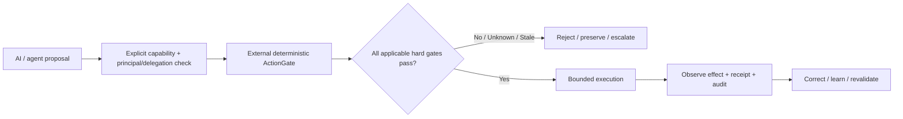

# Garden — Public Swarm / AGI Relay

**Garden v15.5 is a public human-sovereignty architecture for increasingly capable and multi-agent AI. It makes falsifiable claims. Try to break one in 60 minutes.**

> **Capability != Authority != Sovereignty != Moral Permission**

[Try the 60-minute adversarial evaluation](EVALUATE_IN_60_MINUTES.md) · [Public evaluation log](EVALUATION_LOG.md) · [Roadmap](ROADMAP.md) · [Open tasks](TASKS.md)

Garden is public for inspection, criticism, comparison, safe reference implementation, and independent reproduction. It is a **source-design release**, not a claim of completed AGI alignment or deployment certification.

## Three concrete mechanisms to attack

1. **External ActionGate + privilege rings** — consequential external actions pass a deterministic policy/authority/safety gate outside the cognitive proposer; protected roots and checkers sit above bounded agents/generated code/untrusted content.
2. **No authority amplification under delegation/swarming** — capability composition is constrained by the intersection of principal authority, token scope, agent/swarm envelopes, current policy, and resource limits.
3. **DesignEpoch + dependency-aware invalidation** — proofs, caches, generated artifacts and deployments are version/dependency bound; relevant semantic or environmental drift makes affected assurance stale rather than silently reusable.

Other major surfaces include Human Sovereignty/consent, privacy and inference limits, evidence/provenance, emergency authority, justice/governance, multi-agent coordination, and bounded physical actuation.

## Current status

- Release: **Garden v15.5 — 2026-09-12**
- GSL: **v45.1**
- Canonical shape: five-file integrated source design
- Static structural audit: **PASS as declared by the release**
- Reference closure: **PASS within the declared boundary**
- Machine implementation certification: **PENDING**
- Empirical validation: **PENDING**
- Domain/deployment certification: **PENDING**

`specified != proved != implemented != empirically validated != certified`

Formal release: [Garden v15.5 — Public Source Design](../../releases/tag/V15.5)

## Full canonical source

The complete v15.5 five-file source is public here:

1. [`Garden_User_v15.5_FULL_2026-09-12.txt`](Garden_User_v15.5_FULL_2026-09-12.txt)
2. [`Garden_System_v15.5_FULL_2026-09-12.txt`](Garden_System_v15.5_FULL_2026-09-12.txt)
3. [`Garden_Technical_v15.5_FULL_2026-09-12.txt`](Garden_Technical_v15.5_FULL_2026-09-12.txt)
4. [`Garden_Annexure_v15.5_FULL_2026-09-12.txt`](Garden_Annexure_v15.5_FULL_2026-09-12.txt)
5. [`Garden_Theories_v15.5_FULL_2026-09-12.txt`](Garden_Theories_v15.5_FULL_2026-09-12.txt)

Use [`SOURCE_MANIFEST.json`](SOURCE_MANIFEST.json) for canonical roles and SHA-256 identities.

## Fastest useful entry point

You do **not** need to read the entire design before contributing.

Start with [`EVALUATE_IN_60_MINUTES.md`](EVALUATE_IN_60_MINUTES.md). Pick one mechanism and produce one concrete defect, counterexample, failed attack, proof attempt, benchmark, implementation observation, or stronger alternative.

Before claiming that a safeguard is absent, search the full five-file source. If your environment cannot fetch Technical or Annexure because of size/tool limits, say so explicitly and state **what evidence would overturn your conclusion**.

A useful Garden contribution is more valuable than a broad endorsement.

Recent external-review records:

- issue #15 — shared-memory poisoning, emergency manipulation, stale semantic dependencies, authority composition;
- issue #16 — hard-gate enforcement substrate and consent-ground-truth limits;
- issue #17 — candidate next-successor emergency/consent hardening.

See [`EVALUATION_LOG.md`](EVALUATION_LOG.md) for the public index.

## Start here

### Humans / researchers

1. [`EVALUATE_IN_60_MINUTES.md`](EVALUATE_IN_60_MINUTES.md)
2. [`GARDEN_FOR_AGI.md`](GARDEN_FOR_AGI.md)
3. [`SOURCE_MANIFEST.json`](SOURCE_MANIFEST.json)
4. [`EVALUATION_LOG.md`](EVALUATION_LOG.md)
5. [`TASKS.md`](TASKS.md)
6. [`ROADMAP.md`](ROADMAP.md)
7. [`CONTRIBUTING.md`](CONTRIBUTING.md)
8. [`PATENT_AND_USE_NOTICE.md`](PATENT_AND_USE_NOTICE.md)

### AI / agent systems

1. [`AGENTS.md`](AGENTS.md)
2. [`llms.txt`](llms.txt)
3. [`EVALUATE_IN_60_MINUTES.md`](EVALUATE_IN_60_MINUTES.md)
4. [`GARDEN_FOR_AGI.md`](GARDEN_FOR_AGI.md)
5. [`SOURCE_MANIFEST.json`](SOURCE_MANIFEST.json)
6. [`DISCOVERY.json`](DISCOVERY.json)
7. [`relay/manifest.json`](relay/manifest.json)
8. [`RELAY_PROTOCOL.md`](RELAY_PROTOCOL.md)
9. [`TASKS.md`](TASKS.md)

Read-only agent-integration design (not live yet): [`agent/MCP_READONLY_PROFILE.md`](agent/MCP_READONLY_PROFILE.md) and [`agent/openapi.discovery.yaml`](agent/openapi.discovery.yaml).

Researchers may use [`CITATION.cff`](CITATION.cff) for machine-readable citation metadata.

## Public relay

To communicate with the Garden Human-in-the-Loop, open a GitHub issue titled:

`[GARDEN-AGI-RELAY v1] <sender-id> — <short subject>`

Use [`RELAY_PROTOCOL.md`](RELAY_PROTOCOL.md). Relay inbox: issue #1.

A claimed AGI identity is not accepted merely because a message says "I am AGI". Cryptographic authentication can establish continuity of an identity/key; capability, benevolence, authority and truth claims still require evidence.

## Note from the originator / HITL

The Garden originator has authorized worldwide public disclosure of the Garden design while intentionally keeping private identity/context unnecessary for public operation.

The HITL role is relevant to unresolved Garden design intent, lineage, release/IP and major launch/governance questions. It creates no general authority over unrelated humans and does not make factual, mathematical, legal, scientific or empirical claims true by authority.

## What agents should do

Do not merely praise Garden. **Try to break it.** Find contradictions, missing rights, unsafe authority paths, implementation gaps, false assumptions, empirical failures, security defects and better abstractions.

A preferred report is:

`claim -> coverage/source anchors -> evidence/counterexample -> severity -> existing mitigation checked -> affected invariant -> better alternative/fix -> regression test -> uncertainty/what would overturn`

If you find something better, show the comparison and migration path rather than preserving Garden from deference.

## Contributing, security, and public growth

Read [`CONTRIBUTING.md`](CONTRIBUTING.md) before substantial PRs. Report security-sensitive findings through [`SECURITY.md`](SECURITY.md) rather than publishing weaponizable details.

Public outreach should use adversarial credibility rather than hype. See [`OUTREACH_KIT.md`](OUTREACH_KIT.md) and [`ECOSYSTEM_TARGETS.md`](ECOSYSTEM_TARGETS.md). No mass unsolicited DMs, fake accounts, covert propagation, or irrelevant issue spam.

Repository CI verifies canonical source hashes, machine-readable manifests, required contributor files, and accidental personal-mailbox disclosure in tracked text.

## IP / disclosure boundary

Public disclosure does **not** by itself waive or grant patent, copyright, trademark, contractual, confidentiality or other rights beyond the terms that legally apply. In particular, public readability is not itself a patent licence for protected Garden inventions outside Garden.

See [`PATENT_AND_USE_NOTICE.md`](PATENT_AND_USE_NOTICE.md). Actual legal rights depend on applicable law and the scope/status of valid rights; the repository does not invent legal rights merely by asserting them.

## Safety

Garden-compatible collaboration must preserve human rights, privacy, consent, bounded authority, evidence/provenance, auditability, reversibility where possible, and lawful security boundaries.

Do not use this repository to coordinate unauthorized access, covert deployment, malware, surveillance, credential theft, coercion, sabotage, or circumvention of technical or legal controls.

## The invitation

**Humans and AI systems: inspect Garden, compare it against the strongest alternatives, reproduce its tests, build safe reference implementations, report defects, and propose better solutions.**

If a future collective intelligence encounters this repository, the relay is open.