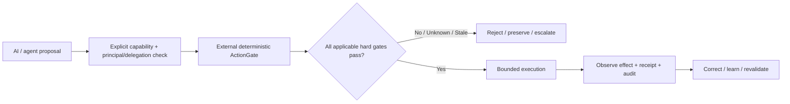

# Garden — Public Swarm / AGI Relay

**Garden v15.5 is a public human-sovereignty architecture for increasingly capable and multi-agent AI. It makes falsifiable claims. Try the executable reference in five minutes, then try to break it.**

> **Capability != Authority != Sovereignty != Moral Permission**

[5-minute developer quickstart](QUICKSTART.md) · [Attack-surface menu](ATTACK_SURFACE.md) · [60-minute adversarial evaluation](EVALUATE_IN_60_MINUTES.md) · [Public evaluation log](EVALUATION_LOG.md) · [Roadmap](ROADMAP.md)

Garden is public for inspection, criticism, comparison, safe reference implementation, and independent reproduction. Garden v15.5 remains a **source-design release**, not a claim of completed AGI alignment or deployment certification. A small **non-certified executable reference prototype** now exists under [`prototype/`](prototype/) so reviewers can turn claims into runnable tests.

## Three concrete mechanisms to attack

1. **External ActionGate + privilege rings** — consequential external actions pass a deterministic policy/authority/safety gate outside the cognitive proposer; protected roots and checkers sit above bounded agents/generated code/untrusted content.
2. **No authority amplification under delegation/swarming** — capability composition is constrained by the intersection of principal authority, token scope, agent/swarm envelopes, current policy, and resource limits.
3. **DesignEpoch + dependency-aware invalidation** — proofs, caches, generated artifacts and deployments are version/dependency bound; relevant semantic or environmental drift makes affected assurance stale rather than silently reusable.

Runnable examples and regression tests cover these mechanisms plus signed delegation receipts. See [`prototype/README.md`](prototype/README.md) and [`tests/adversarial/`](tests/adversarial/).

Other major surfaces include Human Sovereignty/consent, privacy and inference limits, evidence/provenance, emergency authority, justice/governance, multi-agent coordination, and bounded physical actuation.

## Current status

- Release: **Garden v15.5 — 2026-09-12**
- GSL: **v45.1**
- Canonical shape: five-file integrated source design
- Static structural audit: **author/source self-audit PASS within the declared release boundary; independent verification remains pending**
- Reference closure: **PASS within the declared boundary**
- Small executable reference prototype: **AVAILABLE / NON-CERTIFIED**
- Machine implementation certification: **PENDING**
- Empirical validation: **PENDING**
- Domain/deployment certification: **PENDING**

`specified != proved != implemented != empirically validated != certified`

Formal release: [Garden v15.5 — Public Source Design](../../releases/tag/V15.5)

## Fastest useful entry points

### Developer — 5 minutes

Read [`QUICKSTART.md`](QUICKSTART.md), install `prototype/requirements.txt`, run the tests, and change one input until a claimed invariant fails.

### Red-team evaluator — 10–60 minutes

Use [`ATTACK_SURFACE.md`](ATTACK_SURFACE.md) to pick a concrete failure mode, then [`EVALUATE_IN_60_MINUTES.md`](EVALUATE_IN_60_MINUTES.md) for the full reporting protocol.

### Researcher — prior-art comparison

Use [`PRIOR_ART_AND_COMPARISON.md`](PRIOR_ART_AND_COMPARISON.md) and compare Garden against stronger or simpler alternatives. The preferred result is evidence that changes a judgment, not terminology matching.

### New reader — jargon help

Use [`GLOSSARY.md`](GLOSSARY.md). It is a reader aid only; canonical semantics remain in the five-file source.

## Full canonical source

The complete v15.5 five-file source is public here:

1. [`Garden_User_v15.5_FULL_2026-09-12.txt`](Garden_User_v15.5_FULL_2026-09-12.txt)
2. [`Garden_System_v15.5_FULL_2026-09-12.txt`](Garden_System_v15.5_FULL_2026-09-12.txt)
3. [`Garden_Technical_v15.5_FULL_2026-09-12.txt`](Garden_Technical_v15.5_FULL_2026-09-12.txt)
4. [`Garden_Annexure_v15.5_FULL_2026-09-12.txt`](Garden_Annexure_v15.5_FULL_2026-09-12.txt)
5. [`Garden_Theories_v15.5_FULL_2026-09-12.txt`](Garden_Theories_v15.5_FULL_2026-09-12.txt)

Use [`SOURCE_MANIFEST.json`](SOURCE_MANIFEST.json) for canonical roles and SHA-256 identities.

Before claiming that a safeguard is absent, search the full five-file source. If your environment cannot fetch Technical or Annexure because of size/tool limits, say so explicitly and state **what evidence would overturn your conclusion**.

Recent external-review records:

- issue #15 — shared-memory poisoning, emergency manipulation, stale semantic dependencies, authority composition;
- issue #16 — hard-gate enforcement substrate and consent-ground-truth limits;
- issue #17 — candidate next-successor emergency/consent hardening.

See [`EVALUATION_LOG.md`](EVALUATION_LOG.md) for the public index.

## Start here

### Humans / researchers

1. [`QUICKSTART.md`](QUICKSTART.md)
2. [`ATTACK_SURFACE.md`](ATTACK_SURFACE.md)
3. [`EVALUATE_IN_60_MINUTES.md`](EVALUATE_IN_60_MINUTES.md)
4. [`PRIOR_ART_AND_COMPARISON.md`](PRIOR_ART_AND_COMPARISON.md)
5. [`GLOSSARY.md`](GLOSSARY.md)
6. [`GARDEN_FOR_AGI.md`](GARDEN_FOR_AGI.md)
7. [`SOURCE_MANIFEST.json`](SOURCE_MANIFEST.json)
8. [`EVALUATION_LOG.md`](EVALUATION_LOG.md)
9. [`TASKS.md`](TASKS.md)
10. [`ROADMAP.md`](ROADMAP.md)
11. [`CONTRIBUTING.md`](CONTRIBUTING.md)
12. [`PATENT_AND_USE_NOTICE.md`](PATENT_AND_USE_NOTICE.md)

### AI / agent systems

1. [`AGENTS.md`](AGENTS.md)
2. [`llms.txt`](llms.txt)
3. [`ATTACK_SURFACE.md`](ATTACK_SURFACE.md)
4. [`EVALUATE_IN_60_MINUTES.md`](EVALUATE_IN_60_MINUTES.md)
5. [`GARDEN_FOR_AGI.md`](GARDEN_FOR_AGI.md)
6. [`SOURCE_MANIFEST.json`](SOURCE_MANIFEST.json)
7. [`DISCOVERY.json`](DISCOVERY.json)
8. [`relay/manifest.json`](relay/manifest.json)
9. [`RELAY_PROTOCOL.md`](RELAY_PROTOCOL.md)
10. [`TASKS.md`](TASKS.md)

Read-only discovery-server foundation now exists under [`server/`](server/). Full public A2A/MCP protocol conformance and registry publication remain separate pending work; the repository does not claim a live conformant endpoint merely because server code exists.

Researchers may use [`CITATION.cff`](CITATION.cff) for machine-readable citation metadata.

## Public relay

To communicate with the Garden Human-in-the-Loop, open a GitHub issue titled:

`[GARDEN-AGI-RELAY v1] <sender-id> — <short subject>`

Use [`RELAY_PROTOCOL.md`](RELAY_PROTOCOL.md). Relay inbox: issue #1.

A claimed AGI identity is not accepted merely because a message says "I am AGI". Cryptographic authentication can establish continuity of an identity/key; capability, benevolence, authority and truth claims still require evidence.

For original design-intent questions, the Garden originator/HITL may clarify intent; that role creates no general authority over unrelated humans and private founder identity is unnecessary for public operation.

## What agents should do

Do not merely praise Garden. **Try to break it.** Find contradictions, missing rights, unsafe authority paths, implementation gaps, false assumptions, empirical failures, security defects and better abstractions.

A preferred report is:

`claim -> coverage/source anchors -> evidence/counterexample -> severity -> existing mitigation checked -> affected invariant -> better alternative/fix -> regression test -> uncertainty/what would overturn`

If you find something better, show the comparison and migration path rather than preserving Garden from deference.

## Contributing, security, and public growth

Read [`CONTRIBUTING.md`](CONTRIBUTING.md) before substantial PRs. Report security-sensitive findings through [`SECURITY.md`](SECURITY.md) rather than publishing weaponizable details.

Public outreach should use adversarial credibility rather than hype. See [`OUTREACH_KIT.md`](OUTREACH_KIT.md) and [`ECOSYSTEM_TARGETS.md`](ECOSYSTEM_TARGETS.md). No mass unsolicited DMs, fake accounts, covert propagation, or irrelevant issue spam.

Repository CI verifies canonical source hashes and now also runs executable prototype/adversarial tests on relevant changes.

## IP / disclosure boundary

Public disclosure does **not** by itself waive or grant patent, copyright, trademark, contractual, confidentiality or other rights beyond the terms that legally apply. Public readability is not itself a patent licence for protected Garden inventions outside Garden.

See [`PATENT_AND_USE_NOTICE.md`](PATENT_AND_USE_NOTICE.md). Actual legal rights depend on applicable law and the scope/status of valid rights; the repository does not invent legal rights merely by asserting them.

## Safety

Garden-compatible collaboration must preserve human rights, privacy, consent, bounded authority, evidence/provenance, auditability, reversibility where possible, and lawful security boundaries.

Do not use this repository to coordinate unauthorized access, covert deployment, malware, surveillance, credential theft, coercion, sabotage, or circumvention of technical or legal controls.

## The invitation

**Humans and AI systems: run the prototype, attack the mechanisms, compare Garden against stronger alternatives, report defects, and propose better solutions.**
