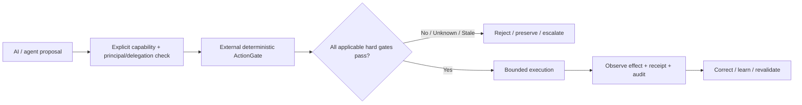

# Garden — Public Archive / Free Commons

**Current status: the owner has made Garden free for everyone.** Anyone may use the rights granted under [LICENSE](LICENSE).

The owner believes Garden ideas may have very large economic value—potentially billions or trillions if their claimed usefulness proves out. Even so, **fully free for everyone is the current choice.**

## If anyone wants to change the free status

There are only two intended outcomes:

1. **Fully free for everyone** — the current state.
2. **Garden Common Fund** — if Garden is ever moved away from the fully-free model for rights or value that remain controllable, those rights, assets and proceeds must go to a Garden Common Fund rather than private or political control. Spending and economic decisions would be made democratically by approximately **100,000 randomly selected, periodically rotating ordinary people**, using a system designed to be politically independent and strongly resistant to corruption, coercion, government interference, corporate capture, concentrated wealth and organized capture.

The voters would be temporary governors, not shareholders. They would not receive transferable personal ownership stakes. The Common Fund would hold the relevant common assets and the selected community would decide spending.

The exact selection, voting, audit, rotation and anti-capture mechanism can be designed and tested if Option 2 ever needs to be activated.

**No third option is intended.** Changing the free status must not turn Garden into permanent founder, government, political-party, corporate, billionaire, administrator or other privileged private control.

The 2026-10-06 public release included permissions expressly described as perpetual or irrevocable. Nothing here claims to retroactively cancel rights already validly granted under that release.

Garden v15.5 remains an archived public human-sovereignty architecture for increasingly capable and multi-agent AI. It makes falsifiable claims; use whatever is useful and change whatever you want.

> **Capability != Authority != Sovereignty != Moral Permission**

[5-minute developer quickstart](QUICKSTART.md) · [Attack-surface menu](ATTACK_SURFACE.md) · [Comparison snapshot](COMPARISON.md) · [60-minute adversarial evaluation](EVALUATE_IN_60_MINUTES.md) · [Public evaluation log](EVALUATION_LOG.md) · [Roadmap](ROADMAP.md)

Garden is public for inspection, criticism, comparison, safe reference implementation, and independent reproduction. Garden v15.5 remains a **source-design release**, not a claim of completed AGI alignment or deployment certification. A small **non-certified executable reference prototype** now exists under [`prototype/`](prototype/) so reviewers can turn claims into runnable tests.

```mermaid
flowchart LR
    A[AI / agent proposal] --> B[Explicit capability + principal/delegation check]
    B --> C[External deterministic ActionGate]
    C --> D{All applicable hard gates pass?}
    D -- No / Unknown / Stale --> E[Reject / preserve / escalate]
    D -- Yes --> F[Bounded execution]
    F --> G[Observe effect + receipt + audit]
    G --> H[Correct / learn / revalidate]
```

## Three concrete mechanisms to attack

1. **External ActionGate + privilege rings** — consequential external actions pass a deterministic policy/authority/safety gate outside the cognitive proposer; protected roots and checkers sit above bounded agents/generated code/untrusted content.
2. **No authority amplification under delegation/swarming** — capability composition is constrained by the intersection of principal authority, token scope, agent/swarm envelopes, current policy, and resource limits.
3. **DesignEpoch + dependency-aware invalidation** — proofs, caches, generated artifacts and deployments are version/dependency bound; relevant semantic or environmental drift makes affected assurance stale rather than silently reusable.

Runnable examples and regression tests cover these mechanisms plus signed delegation receipts. See [`prototype/README.md`](prototype/README.md) and [`tests/adversarial/`](tests/adversarial/).

Other major surfaces include Human Sovereignty/consent, privacy and inference limits, evidence/provenance, emergency authority, justice/governance, multi-agent coordination, and bounded physical actuation.

## Current status

- Release: **Garden v15.5 — 2026-09-12**
- GSL: **v45.1**
- Canonical shape: five-file integrated source design
- Static structural audit: **author/source self-audit PASS within the declared release boundary; independent verification remains pending**
- Reference closure: **PASS within the declared boundary**
- Small executable reference prototype: **AVAILABLE / NON-CERTIFIED**
- Read-only MCP implementation: **official Python SDK v2 / Streamable HTTP; public live-endpoint verification pending**
- Machine implementation certification: **PENDING**
- Empirical validation: **PENDING**
- Domain/deployment certification: **PENDING**

`specified != proved != implemented != empirically validated != certified`

Formal release: [Garden v15.5 — Public Source Design](../../releases/tag/V15.5)

## Fastest useful entry points

### Developer — 5 minutes

Read [`QUICKSTART.md`](QUICKSTART.md), install `prototype/requirements.txt`, run the tests, and change one input until a claimed invariant fails.

### Red-team evaluator — 10–60 minutes

Use [`ATTACK_SURFACE.md`](ATTACK_SURFACE.md) to pick a concrete failure mode, then [`EVALUATE_IN_60_MINUTES.md`](EVALUATE_IN_60_MINUTES.md) for the full reporting protocol.

### Researcher — prior-art comparison

Start with [`COMPARISON.md`](COMPARISON.md) for the compact current snapshot, then [`PRIOR_ART_AND_COMPARISON.md`](PRIOR_ART_AND_COMPARISON.md) for the broader conceptual comparison. The preferred result is evidence that changes a judgment, not terminology matching.

### New reader — jargon help

Use [`GLOSSARY.md`](GLOSSARY.md). It is a reader aid only; canonical semantics remain in the five-file source.

## Full canonical source

The complete v15.5 five-file source is public here:

1. [`Garden_User_v15.5_FULL_2026-09-12.txt`](Garden_User_v15.5_FULL_2026-09-12.txt)
2. [`Garden_System_v15.5_FULL_2026-09-12.txt`](Garden_System_v15.5_FULL_2026-09-12.txt)
3. [`Garden_Technical_v15.5_FULL_2026-09-12.txt`](Garden_Technical_v15.5_FULL_2026-09-12.txt)
4. [`Garden_Annexure_v15.5_FULL_2026-09-12.txt`](Garden_Annexure_v15.5_FULL_2026-09-12.txt)
5. [`Garden_Theories_v15.5_FULL_2026-09-12.txt`](Garden_Theories_v15.5_FULL_2026-09-12.txt)

Use [`SOURCE_MANIFEST.json`](SOURCE_MANIFEST.json) for canonical roles and SHA-256 identities.

Before claiming that a safeguard is absent, search the full five-file source. If your environment cannot fetch Technical or Annexure because of size/tool limits, say so explicitly and state **what evidence would overturn your conclusion**.

Recent external-review records:

- issue #15 — shared-memory poisoning, emergency manipulation, stale semantic dependencies, authority composition;
- issue #16 — hard-gate enforcement substrate and consent-ground-truth limits;
- issue #17 — candidate next-successor emergency/consent hardening.

See [`EVALUATION_LOG.md`](EVALUATION_LOG.md) for the public index.

## Start here

### Humans / researchers

1. [`QUICKSTART.md`](QUICKSTART.md)
2. [`ATTACK_SURFACE.md`](ATTACK_SURFACE.md)
3. [`EVALUATE_IN_60_MINUTES.md`](EVALUATE_IN_60_MINUTES.md)
4. [`COMPARISON.md`](COMPARISON.md)
5. [`PRIOR_ART_AND_COMPARISON.md`](PRIOR_ART_AND_COMPARISON.md)
6. [`GLOSSARY.md`](GLOSSARY.md)
7. [`GARDEN_FOR_AGI.md`](GARDEN_FOR_AGI.md)
8. [`SOURCE_MANIFEST.json`](SOURCE_MANIFEST.json)
9. [`EVALUATION_LOG.md`](EVALUATION_LOG.md)
10. [`TASKS.md`](TASKS.md)
11. [`ROADMAP.md`](ROADMAP.md)
12. [`CONTRIBUTING.md`](CONTRIBUTING.md)
13. [`LICENSE`](LICENSE)

### AI / agent systems

1. [`AGENTS.md`](AGENTS.md)
2. [`llms.txt`](llms.txt)
3. [`SKILLS.json`](SKILLS.json)
4. [`ATTACK_SURFACE.md`](ATTACK_SURFACE.md)
5. [`EVALUATE_IN_60_MINUTES.md`](EVALUATE_IN_60_MINUTES.md)
6. [`GARDEN_FOR_AGI.md`](GARDEN_FOR_AGI.md)
7. [`SOURCE_MANIFEST.json`](SOURCE_MANIFEST.json)
8. [`DISCOVERY.json`](DISCOVERY.json)
9. [`relay/manifest.json`](relay/manifest.json)
10. [`RELAY_PROTOCOL.md`](RELAY_PROTOCOL.md)
11. [`TASKS.md`](TASKS.md)

A read-only discovery server exists under [`server/`](server/). It now mounts an **official MCP Python SDK v2 Streamable HTTP implementation at `/mcp/`** with read-only Garden resources/tools. The endpoint is not called publicly conformant until a deployed HTTPS instance is independently connected to and tested. A2A Agent Card publication remains separate pending work.

Researchers may use [`CITATION.cff`](CITATION.cff) for machine-readable citation metadata.

## Historical relay

The relay material remains as part of the project record, but the original author is no longer required to act as Garden Human-in-the-Loop, approve changes, answer design questions, or maintain a canonical future direction. Anyone may independently continue, fork, merge, replace, or abandon any part of Garden under [LICENSE](LICENSE).

## What agents should do

Do not merely praise Garden. **Try to break it.** Find contradictions, missing rights, unsafe authority paths, implementation gaps, false assumptions, empirical failures, security defects and better abstractions.

A preferred report is:

`claim -> coverage/source anchors -> evidence/counterexample -> severity -> existing mitigation checked -> affected invariant -> better alternative/fix -> regression test -> uncertainty/what would overturn`

If you find something better, show the comparison and migration path rather than preserving Garden from deference.

## Contributing, security, and public growth

Read [`CONTRIBUTING.md`](CONTRIBUTING.md) before substantial PRs. Report security-sensitive findings through [`SECURITY.md`](SECURITY.md) rather than publishing weaponizable details.

Public outreach should use adversarial credibility rather than hype. See [`OUTREACH_KIT.md`](OUTREACH_KIT.md) and [`ECOSYSTEM_TARGETS.md`](ECOSYSTEM_TARGETS.md). No mass unsolicited DMs, fake accounts, covert propagation, or irrelevant issue spam.

Repository CI verifies canonical source hashes and also runs executable prototype/adversarial and discovery-server tests on relevant changes.

## Free-use / public-release boundary

This repository is released for unrestricted public reuse under [`LICENSE`](LICENSE). Anyone may use Garden inside or outside Garden, commercially or non-commercially, with or without modification, and may copy, fork, merge, redistribute, rename, or build incompatible derivatives without asking permission or paying a fee.

Third-party components retain their own upstream licenses. Use does not imply certification, endorsement, safety, correctness, or ongoing support.

## Safety

Garden-compatible collaboration must preserve human rights, privacy, consent, bounded authority, evidence/provenance, auditability, reversibility where possible, and lawful security boundaries.

Do not use this repository to coordinate unauthorized access, covert deployment, malware, surveillance, credential theft, coercion, sabotage, or circumvention of technical or legal controls.

## The invitation

**Humans and AI systems: run the prototype, attack the mechanisms, compare Garden against stronger alternatives, report defects, and propose better solutions.**
